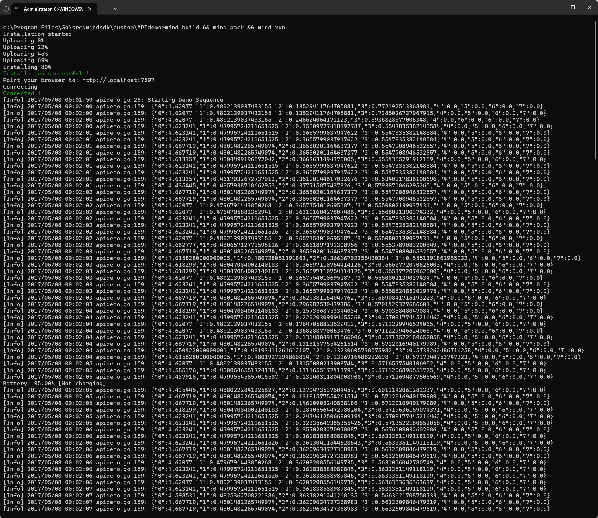

# Demonstration of Hexasense API Usage

This demo HEXA project shows the basic operation of the Hexasense API in the context of a Mind SDK Go script.
To execute this demo, the "APIdemo" folder and all it's contents should be copied to your ```~/go/src/mindsdk/``` directory and executed from inside the APIdemo directory using the command ```mind build && mind pack && mind run```

The Go script itself is found at ```/APIdemo/src/apidemo.go```

This simple script performs a full range motion on each of the leg joints whilst calling the Hexasense API via HTTP and printing the API response JSON string to the console, a shown in the sample output below.


## The callAPI() Function

