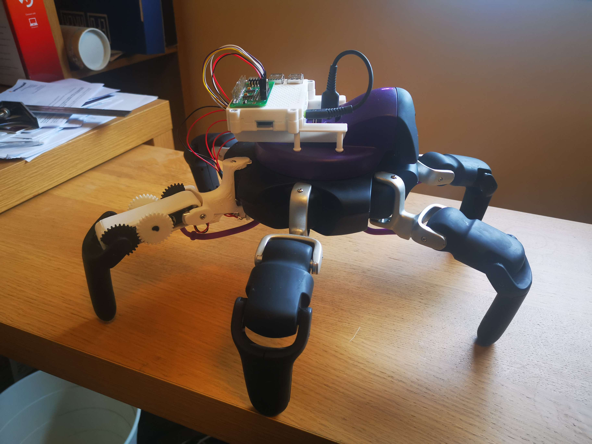
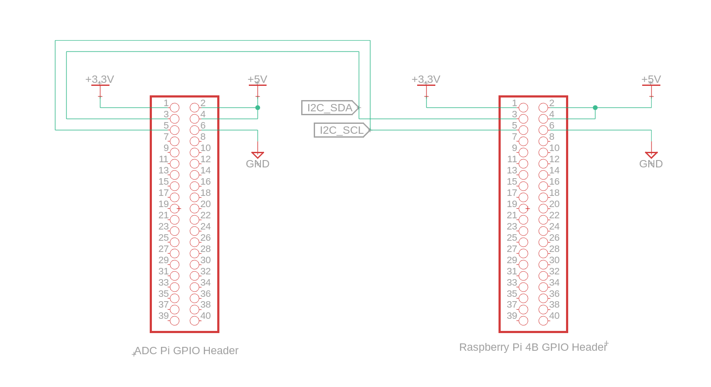
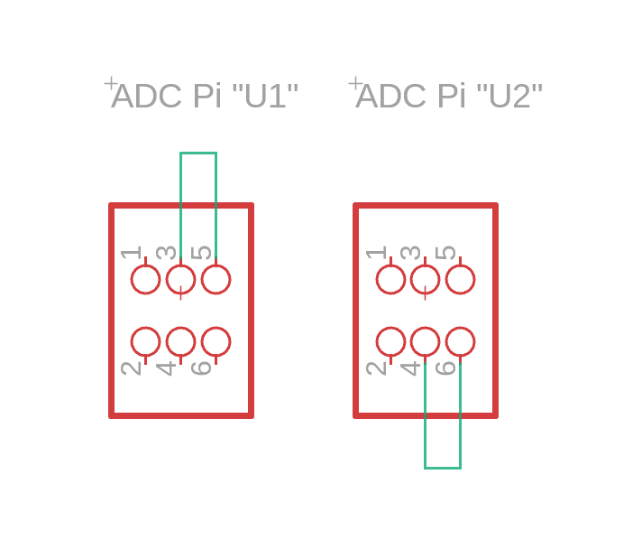
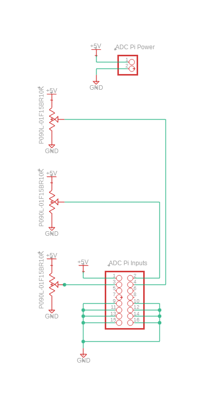
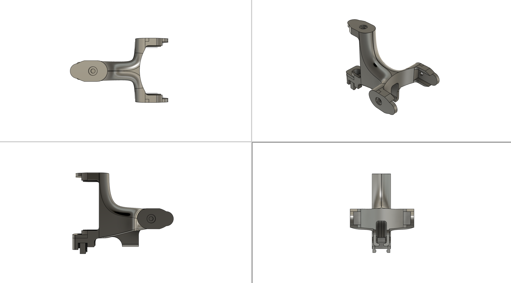
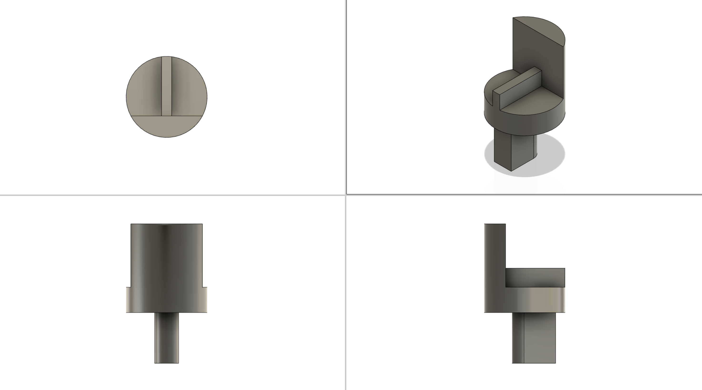
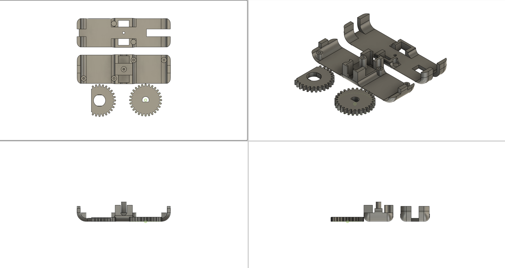
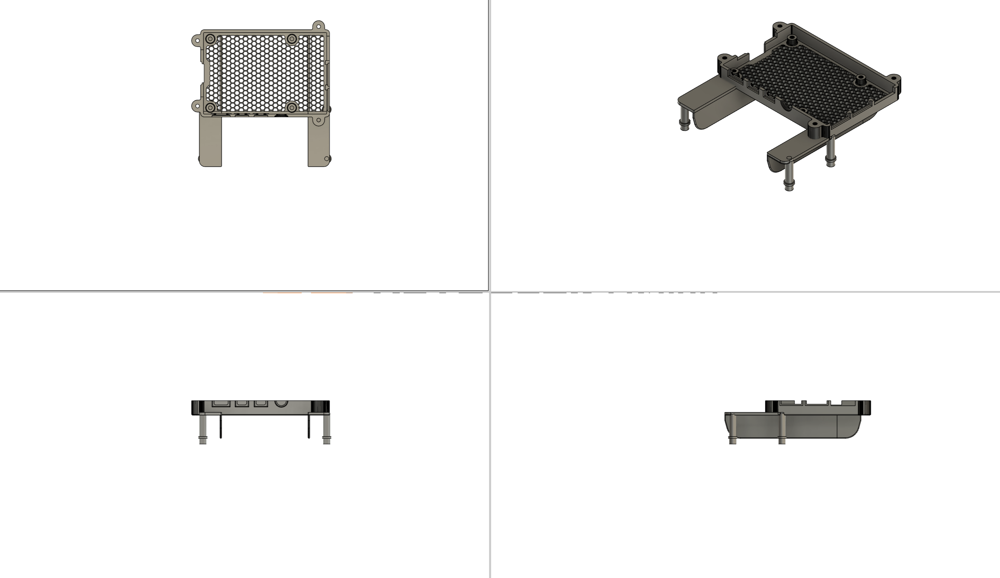

# Hexasense API v0.1 - Hardware Implementation

This seems like it's going to be a dense document so, if you don't have one already, get yourself a coffee first.

## Design Intent

The intention of this hardware design is to provide a means of sensing the position of the actuators of the HEXA robot whilst maintaining the ability to fully revert the robot to it's original factory state. 
Any instance where modification of the robot's hardware would be required, an appropriate 3D printed part has been designed to integrate in place of the original robot hardware. 
It is also intended that the SBC component part of this system should function as an analogue for the HEXA robot to allow future integration of the Hexasense API software solution and ADC system directly with the HEXA robot itself, negating the need for the additional SBC hardware and potentially increasing the responsiveness of the API in use. 

## Hardware Description

The hardware implementation to add a proprioceptive sensing system to the HEXA Robot can be described as having three component parts to it's structure.
- A "Digital Twin" Data Processing & Relay System - Comprising of an off-the-shelf Raspberry Pi 4B SBC
- An ADC Measurement System - Comprising of a series of potentiometers mechanically coupled to the robot's actuators and an off-the-shelf ADC printed circuit board interfaced with the Data Processing & Relay System using the I2C protocol
- The Mechanical Hardware Assembly - A series of plastic parts manufactured using an FDM rapid prototyping process and designed to integrate the sensing system with the robot's hardware

These three component parts function together to deliver the desired actuator positional data required by the project.

 
### Raspberry Pi 4B SBC - The "Digital Twin"

This small single board computer provides a method of capturing the sensing data from the I2C bus and relaying it to the HEXA robot.
The SBC is configured to detect and connect to the HEXA robot's wifi access point automatically and begin broadcasting the sensing data through a network accessible implementation of the python fastAPI library. This will allow the API to be called by a Golang script in order to make use of the sensing data for proprioceptive purposes.

For detailed documentation of the Raspberry Pi 4B, please see the [Raspberry Pi 4B Documentation.](https://www.raspberrypi.com/documentation/computers/raspberry-pi.html)

### ADC Pi - Measurement System

The ADC Pi board is comprised of two MCP3424 ADC ICs and an bi-directional I2C Logic Level converter circuit which converts the Raspberry Pi's 3.3 volt logic level to
a 5 volt logic level suitbale for the MCP3424 ADCs. The ADCs can be queried by the Rapserry Pi over the I2C buss and will return the voltage value present
at each of it's sense pins.

For detailed documentation of the ADC Pi add-on board, please see the [AB Electronics](https://www.abelectronics.co.uk/) website for the [ADC Pi product.](https://www.abelectronics.co.uk/p/69/adc-pi)

### Potentiometers - Actuator Coupling

The prototype implementation uses three TT Electronics P090L-01F15BR10K 10 kilo-ohm linear potentiometers which function as voltage dividers. Each potentiometer has their CW and CCW pins tied to 5 volts and Ground respectively, while their W pin is tied to the respective sense pin of the ADC Pi baord. This allows for the rotation of the potentiometer to result in a change in voltage detected by the ADC IC as a voltage value between the 5 volts and 0 volts.

In principle, any value of potentiometer can be used in this manner, however it is important that the potentiometer selected has a Linear taper type, such that the voltage returned to the ADC at each rotational position of the potentiometer is proportional to the degree of rotation of the potentiometer, allowing the angle of 
rotation to be calculated accurately.

For detailed documentation of the TT Electronics P090L-01F15BR10K potentiometers, please see the TT Electronics [Product Page](https://www.ttelectronics.com/products/passive-components/potentiometers/p090l/) and [Datasheet.](https://www.ttelectronics.com/TTElectronics/media/ProductFiles/Datasheet/P090.pdf)

## Schematic Diagram of Electronic Components

This section describes the electronic connections between the component parts of the system only. 
For detailed schematic diagrams of the individual component parts of the system, please see the individual manufacturer's documentation and datasheets as directed above.

### Connecting the Raspberry Pi to the ADC Pi

The above schematic shows the connections required between the Raspberry Pi SBD and the ADC Pi add-on board for correct operation. 

Although both devices have 40-pin connectors, this is merely for the convenience of direct physical connection during development. In use, only five pin connections are required for correct interoperation of the devices.
The ADC Pi requires both 5v and 3.3v, as well as Ground connections to power the ADC ICs and the 3.3v to 5v logic level converters (as illustrated in the ADC Pi's board schematic). 
Data connection between the two devices is achieved using the I2C0 bus of the Raspberry Pi using the I2C0_SDA (pin 3) and I2C0_SDL (pin 5) connections.

### ADC Pi I2C Bus Address Setting

The above schematic shows the default I2C bus address setting selection for the ADC Pi.

I2C bus addressing of the two MCP3424 ICs is achieved using the "U1" and "U2" physical jumpers on the ADC Pi add-on board. This addressing system allows for a maximum of 8 possible individual chip addresses on the same I2C bus for these devices, allowing for a maximum of 4 ADC Pi add-on boards to be used simultaneously on the same I2C bus.
This would allow for a total of 32 ADC inputs to be addressed, which surpasses the required 19 inputs to implement proprioceptive sensing of all the leg actuators on the HEXA robot (3 actuaors per leg * 6 legs + input voltage reference measurement).
As our prototype only implements proprioception of a single leg currently, only 4 of the available ADC inputs are required for correct operation of the prototype system.

### Connecting the Potentiometers to the ADC Pi

The above schematic shows the potentiometer connections required to implement proprioceptive sensing of three actuators on the HEXA robot.

In order to correctly scale the readings from each connected potentiometer to a value between 0 and 1, we must be able to measure the maximum possible voltage that can be returned from a potentiometer to perform the scaling calculation. This is achieved by dedicating and ADC input solely to measuring the supply voltage of the system. Our software API implementation uses ADC input 1 to achieve this, thus it is imperitive that ADC input 1 be connected to the same 5v supply voltage to which the potentiometers are connected. This circuit design also accounts for situations where the supply voltage may fluctuate such that because the supply voltage is known, the scaling calculation will always return an accurate rotational position for each potentiometer within the operating voltage range of the ADC devices.

The potentiometers function as in-circuit variable voltage dividers. With their CCW pins tied to Ground and their CW pins tied to the supply voltage as shown, the voltage measured at the W pin of the potentiometer can be taken as a percentage value of the supply voltage. As the potentiometers selected have a linear taper type, a 50% rotational position of the potentiometer will always result in a measurement of 50% of the supply voltage at the potentiometer's W pin. Similarly due to a linear potentiometer taper type, a 5% rotational position of the potentiometer would also measure as 5% of the supply voltage at the W pin in this configuration. Given a perfectly linear potentiometer taper, this should result in accurate rotational position measurement of the potentiometer as a percentage of the total angular range of the potentiometer - in this case a percentage of 270 degrees of rotation.

## Mechanical Hardware Assembly

### HEXA Hip Replacement

### HEXA Mid Leg Replacement & Potentiometer Coupling Gears

### SBC & ADC Mounting Solution

NOTE ABOUT HEADMOUNT MODEL SOURCE!